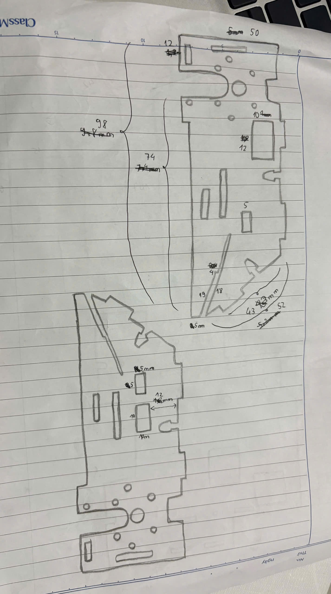
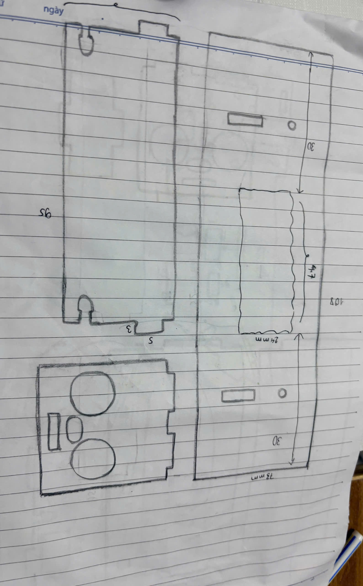
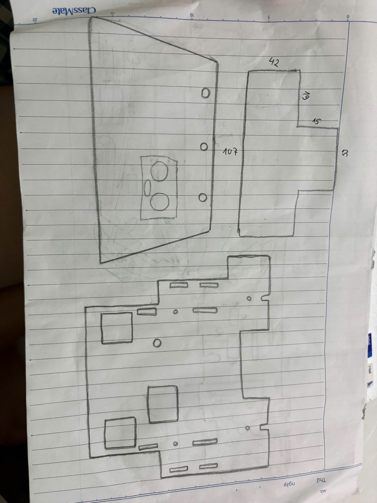
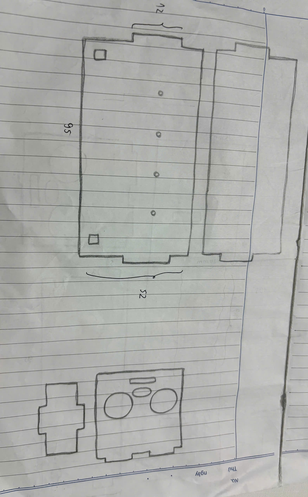
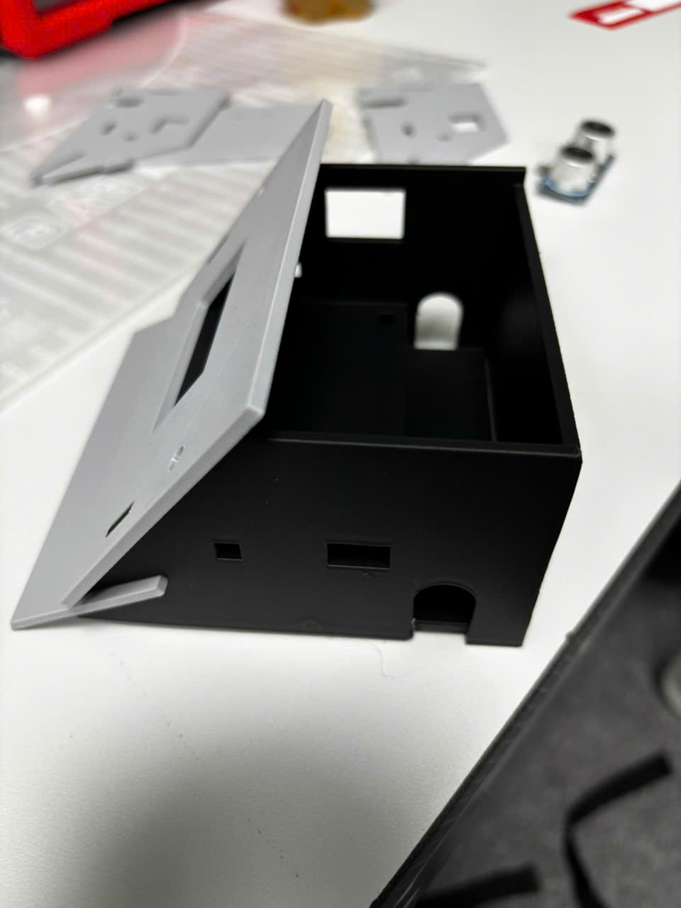
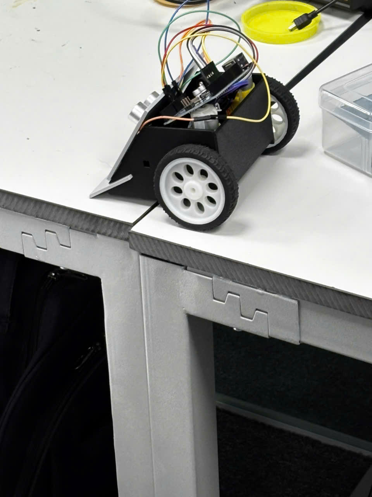
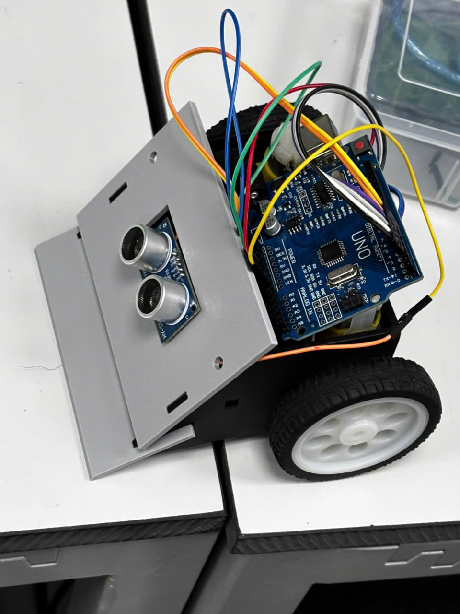
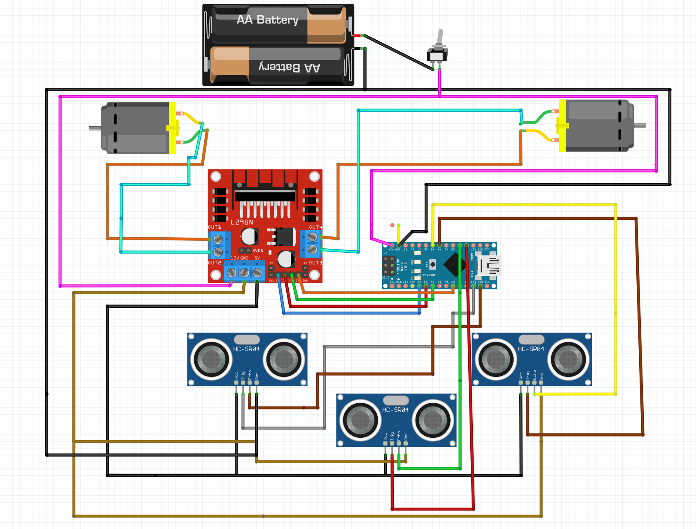

<div align="center">

# ⚡ MiniSumoRobot

**A compact, autonomous sumo robot built for competitive combat**

[](https://www.arduino.cc/)
[](https://isocpp.org/)
[](https://github.com/Yuno-20EA/MiniSumorobot)
[](LICENSE)
[]()

</div>

---

## Overview

MiniSumoRobot is a fully autonomous mini sumo robot designed for competitive sumo battles. The robot uses ultrasonic sensors to detect opponents and deploys a state-machine-driven attack strategy — all within a compact 3D-printed chassis manufactured with precision STL files.

The project spans the complete engineering cycle: **mechanical design → electronics → firmware → testing.**

---

## Gallery

### Robot Frame — Design Sketches

> *Hand-drawn sketches of each structural component*

<table>
  <tr>
    <td align="center">
      <br/>
      <sub>View 1</sub>
    </td>
    <td align="center">
      <br/>
      <sub>View 2</sub>
    </td>
    <td align="center">
      <br/>
      <sub>View 3</sub>
    </td>
    <td align="center">
      <br/>
      <sub>View 4</sub>
    </td>
  </tr>
</table>

### Real-World Photos

> *The completed robot as assembled*

<table>
  <tr>
    <td align="center">
      <br/>
      <sub>Photo 1</sub>
    </td>
    <td align="center">
      <br/>
      <sub>Photo 2</sub>
    </td>
    <td align="center">
      <br/>
      <sub>Photo 3</sub>
    </td>
  </tr>
</table>

---

## Workflow

> *From concept to competition — the full development process*

### Development Pipeline

```
+--------------+     +--------------+     +--------------+     +--------------+
|  Mechanical  |---->|  Electronics |---->|   Firmware   |---->|   Testing    |
|   Design     |     |   Design     |     | Development  |     |  & Combat    |
+--------------+     +--------------+     +--------------+     +--------------+
  3D modeling          Schematic &           Arduino C++          Arena trials
  STL printing         Wiring layout         State machine         Optimization
```

### Workflow Images

> 📌 *Replace each placeholder below with your actual workflow process photos*

| Step | Description |
|:----|:------------|
| 1 | Mechanical design & 3D modeling in CAD |
| 2 | PCB schematic & wiring layout |
| 3 | Firmware flashing & serial debugging |
| 4 | Assembly, integration & combat testing |

---

## Architecture

```
MiniSumoRobot/
│
├── Firmware/
│   └── SrcCodeSumo_Final/
│       └── SrcCodeSumo_Final.ino     # Main Arduino sketch
│
├── Hardware/
│   └── So_Do_Mach_Dien/
│       ├── So_Do_Dau_Day_FinalCheck.fzz   # Fritzing wiring diagram
│       └── Anh_Minh_Hoa_So_Do_Day.png     # Wiring illustration
│
├── Mechanical/
│   ├── Khung_robot_finalcheck.stl         # Full chassis STL
│   ├── MiniRobotComponets/                # Individual part STLs
│   │   ├── Mat_Truoc.stl                  # Front face
│   │   ├── Mat_Ben1.stl                   # Side panel 1
│   │   ├── Mat_Ben2.stl                   # Side panel 2
│   │   ├── Mat_Chua_Dong_Co.stl           # Motor mount
│   │   ├── Mat_Chua_ViDieuKhien.stl       # Controller mount
│   │   ├── Mat_Day.stl                    # Bottom plate
│   │   └── Mat_Phang_Luoi.stl             # Blade panel
│   └── Anh_Chup_CacMatLinhKien/          # Component renders
│
└── Docs/
    ├── AnhThucTe/                         # Real-world photos
    ├── AnhVeTayKhungRobot/                # Hand-drawn sketches
    └── BÁO CÁO KỸ THUẬT CỦA SUMO ROBOT.docx
```

---

## Hardware

### Bill of Materials

| Component | Model / Spec | Qty | Role |
|:----------|:-------------|:---:|:-----|
| Microcontroller | Arduino Nano | 1 | Main control unit |
| Ultrasonic Sensor | HC-SR04 | 3 | Enemy detection — Front / Left / Right |
| DC Motor | N20 Gear Motor | 2 | Drive wheels |
| Motor Driver | L298N / L293D | 1 | PWM motor control |
| Power Supply | Li-Po / 9V Battery | 1 | Power source |
| Chassis | 3D Printed PLA | — | Custom-designed enclosure |
| Wheels | Rubber-grip | 2 | Traction |

### Wiring Diagram

<div align="center">
  
  <br/>
  <sub><i>Full wiring schematic — generated with Fritzing</i></sub>
</div>

### Pin Mapping

| Pin | Signal | Direction |
|:---:|:-------|:---------:|
| D2 | Motor A — IN1 (INA) | OUT |
| D3 | Motor A — IN2 (INB) | OUT |
| D4 | Motor B — IN1 (INC) | OUT |
| D5 | Motor B — IN2 (IND) | OUT |
| A0 | Ultrasonic Front — TRIG | OUT |
| A1 | Ultrasonic Front — ECHO | IN |
| A4 | Ultrasonic Right — TRIG | OUT |
| A5 | Ultrasonic Right — ECHO | IN |
| D10 | Ultrasonic Left — TRIG | OUT |
| D11 | Ultrasonic Left — ECHO | IN |

---

## Mechanical Design

The chassis is fully 3D-printed using PLA filament. All STL files are provided for direct reproduction.

### Component Breakdown

| Part | File | Description |
|:-----|:-----|:------------|
| Front Face | `Mat_Truoc.stl` | Holds front ultrasonic sensor |
| Side Panel 1 | `Mat_Ben1.stl` | Structural left wall |
| Side Panel 2 | `Mat_Ben2.stl` | Structural right wall |
| Motor Mount | `Mat_Chua_Dong_Co.stl` | Motor bracket |
| Controller Mount | `Mat_Chua_ViDieuKhien.stl` | Arduino Nano holder |
| Bottom Plate | `Mat_Day.stl` | Base floor of chassis |
| Blade Panel | `Mat_Phang_Luoi.stl` | Low-profile front pusher |
| Full Assembly | `Khung_robot_finalcheck.stl` | Complete chassis |

### 3D Renders

<table>
  <tr>
    <td align="center">
      <br/>
      <sub>Full Assembly</sub>
    </td>
    <td align="center">
      <br/>
      <sub>Front Face</sub>
    </td>
    <td align="center">
      <br/>
      <sub>Side Panel 1</sub>
    </td>
    <td align="center">
      <br/>
      <sub>Motor Mount</sub>
    </td>
  </tr>
</table>

---

## Firmware

### Logic Overview

The firmware is written in C++ for Arduino and uses a **non-blocking state machine** to manage sensor polling and motor control simultaneously — zero `delay()` calls.

```
Boot → 5-second countdown → Combat mode active

Loop:
  updateSensors() ──► poll 1 of 3 sensors every 30ms (round-robin)
        │
        ▼
  runAttackStateMachine()
        │
        ├── enemyFront  →  MOVE_FORWARD  (charge)
        ├── enemyRight  →  MOVE_RIGHT  →  MOVE_FORWARD
        ├── enemyLeft   →  MOVE_LEFT   →  MOVE_FORWARD
        └── no target   →  MOVE_LEFT   (scanning sweep)
```

### State Machine Phases

| Phase | Description |
|:------|:------------|
| `AP_DECIDE` | Evaluate sensor flags and choose next move |
| `AP_COAST` | Brief motor-off interval before direction change |
| `AP_WAIT_TURN` | Execute turn, then transition to forward thrust |
| `AP_WAIT_FORWARD` | Execute forward charge |

### Key Parameters

```cpp
TIME_FORWARD  = 100 ms   // Duration of forward thrust
TIME_LEFT     = 180 ms   // Duration of left turn
TIME_RIGHT    = 180 ms   // Duration of right turn
COAST_MS      = 20  ms   // Motor coast between direction changes
MAX_DISTANCE  = 50  cm   // Ultrasonic detection range
PING_INTERVAL = 30  ms   // Round-robin sensor poll interval
```

---

## Getting Started

### Prerequisites

- [Arduino IDE](https://www.arduino.cc/en/software) `≥ 1.8` or [PlatformIO](https://platformio.org/)
- Arduino Library: [`NewPing`](https://bitbucket.org/teckel12/arduino-new-ping/wiki/Home) by Tim Eckel

### Flash the Firmware

```bash
# 1. Clone the repository
git clone https://github.com/Yuno-20EA/MiniSumorobot.git
cd MiniSumorobot

# 2. Open in Arduino IDE
# File → Open → Firmware/SrcCodeSumo_Final/SrcCodeSumo_Final.ino

# 3. Install dependency via Library Manager
# Tools → Manage Libraries → Search "NewPing" → Install

# 4. Configure board
# Tools → Board → Arduino Nano
# Tools → Processor → ATmega328P (Old Bootloader)

# 5. Upload to board
```

### Print the Chassis

1. Open any `.stl` file from `Mechanical/MiniRobotComponets/`  
   or use the full assembly: `Mechanical/Khung_robot_finalcheck.stl`
2. Recommended slicer settings:

| Setting | Value |
|:--------|:------|
| Material | PLA |
| Layer height | 0.2 mm |
| Infill | 30 – 40% |
| Supports | Enabled |
| Nozzle temperature | 200 – 210 °C |

---

## Combat Strategy

The robot operates **fully autonomously** after a **5-second activation delay** (standard sumo rule compliance).

```
Priority order (high → low):

  1. Enemy detected FRONT  →  charge forward immediately
  2. Enemy detected RIGHT  →  turn right → charge forward
  3. Enemy detected LEFT   →  turn left  → charge forward
  4. No enemy detected     →  rotate left (scanning sweep)
```

> A **2-consecutive-reading confirmation** filter is applied to each sensor before committing to an attack — preventing false positives from sensor noise.

---

## Documentation

| Document | Location | Description |
|:---------|:---------|:------------|
| Technical Report | [`Docs/`](Docs/) | Full engineering report (Vietnamese) |
| Wiring Schematic | [`Hardware/So_Do_Mach_Dien/`](Hardware/So_Do_Mach_Dien/) | Fritzing source & PNG export |
| 3D Models | [`Mechanical/MiniRobotComponets/`](Mechanical/MiniRobotComponets/) | All STL component files |
| 3D Renders | [`Mechanical/Anh_Chup_CacMatLinhKien/`](Mechanical/Anh_Chup_CacMatLinhKien/) | Render images per component |
| Real Photos | [`Docs/AnhThucTe/`](Docs/AnhThucTe/) | Physical build photos |
| Design Sketches | [`Docs/AnhVeTayKhungRobot/`](Docs/AnhVeTayKhungRobot/) | Hand-drawn frame sketches |

---

## License

This project is licensed under the **MIT License** — see [`LICENSE`](LICENSE) for details.

---

<div align="center">

*Made with precision — MiniSumoRobot · 2025*

</div>
